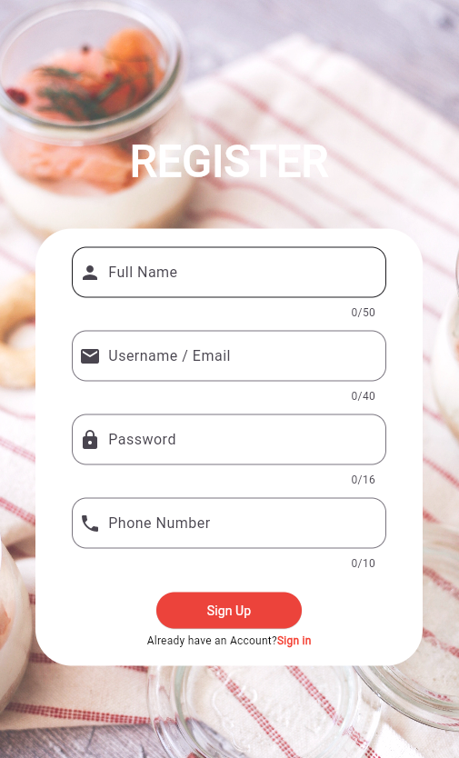

# LUNCH TIME

## Description

The "Random Food" app is a Flutter application that helps users discover random food recipes. Users can simply shake their phone or tap a button to get a random food suggestion, including the recipe details and ingredients. This app is a fun and handy tool for those who can't decide what to cook or want to try new recipes.

## Screenshots





## Features

- Get random food recipes by shaking the phone or tapping a button.
- View detailed information about each recipe, including ingredients and instructions.
- Save your favorite recipes for easy access.
- Share recipes with friends and family.
- Search for specific recipes by name or ingredients.

## Installation

1. Clone the repository:

   ```bash
   git clone https://github.com/JasmineVan/LunchTime-Flutter.git
